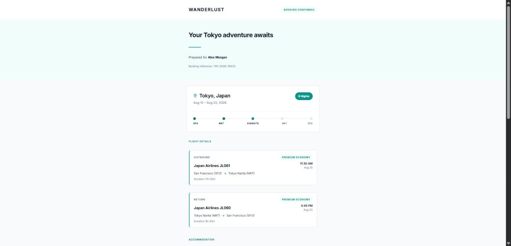
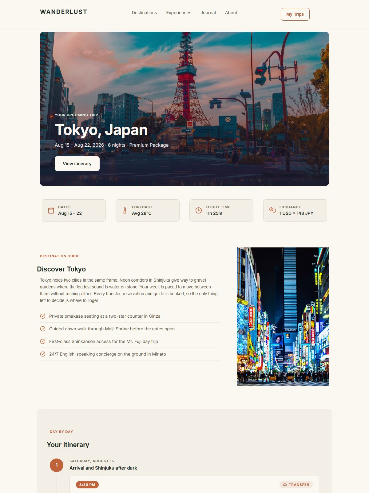
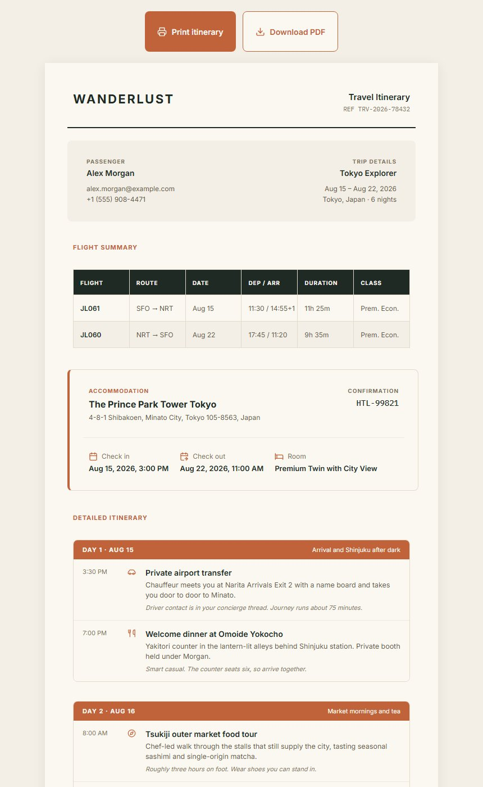

# ✈️ WANDERLUST

**One React codebase. Three render modes. One booking becomes an email, a destination page and a printed itinerary — from a single source of truth.**

WANDERLUST is a luxury travel booking suite built entirely with [Unlayer Elements](https://github.com/unlayer/elements) (`@unlayer/react-elements`). Feed it one reservation record and it renders the complete post-booking experience: the confirmation **email**, the public destination **page**, and a print-ready **itinerary**.

---

## 🧭 What this is

When Alex Morgan books the Tokyo Explorer package, the reservation system has one job left: turn that record into deliverables. WANDERLUST does exactly that with three Elements templates that all consume the same data module:

| Mode | Template | Output |
|---|---|---|
| `<Email>` | Booking confirmation | Bulletproof 600px table HTML (Outlook/Gmail-safe) + a plain-text MIME part |
| `<Page>` | Destination page | Responsive 960px flexbox HTML — hero, quick facts, day-by-day, forecast, gallery |
| `<Document>` | Printed itinerary | 700px print-ready HTML with page-break rules, opens the browser print dialog |

Three more `<Page>` documents come off the same tokens and share the header and footer: `contact.html` (the index in `design imgs/contactPage.png`), `privacy.html` and `terms.html`. The last two are one template rendered twice, with the clauses living in `lib/data.ts` beside everything else.

Swap `src/lib/data.ts` for a row out of a real reservation system and every output updates together — same reference, same times, same totals, everywhere.

## 🚀 How to run

```bash
npm install
npm run render
```

`tsx` here is a build step, not a runtime: it runs `src/render.tsx` once on Node, React renders to HTML strings, and the files are written to `output/`. Nothing React runs in the browser, so no server is required to view the results.

A static server is included anyway, because `file://` behaves differently from `http://` and because serving on the LAN is the honest way to check the responsive breakpoints on a real phone:

```bash
npm start        # render, then serve output/ on http://localhost:4173
npm run preview  # serve what is already rendered
```

`npm run render` writes everything to `output/`:

```
output/
├── email.html               # <Email> table-based, client-safe HTML
├── email.txt                # renderToPlainText text/plain MIME part
├── page.html                # <Page>  responsive destination page
├── itinerary.html           # <Document>  print-ready itinerary
├── itinerary.pdf            # the itinerary as a real PDF (npm run pdf)
├── contact.html             # <Page>  contact index, per design imgs/contactPage.png
├── privacy.html             # <Page>  privacy policy
├── terms.html               # <Page>  terms of service
├── email.design.json        # renderToJson  editor-compatible design JSON
├── page.design.json
└── itinerary.design.json
```

Open any `.html` file in a browser:

```powershell
npm run render
start output/page.html
```

`itinerary.html` carries a print bar: **Print itinerary** opens the browser dialog, **Download PDF** hands over a real file.

That file comes from `npm run pdf`, which drives a local Chrome or Edge over `output/itinerary.html` and writes `assets/itinerary.pdf` (set `CHROME_PATH` if neither is in the usual place). It lands in `assets/` and is committed on purpose: the deploy host has no browser to generate it, so `npm run build` just copies it next to the HTML, the same way it copies the favicon. Re-run `npm run pdf` whenever the itinerary content changes.

Drop the `.design.json` files into the Unlayer visual editor to keep iterating there.

Type-check without emitting:

```bash
npm run typecheck
```

## ▲ Deploying to Vercel

`npm run build` is the deploy build: it renders the templates, then writes `output/index.html` — a card grid linking to all three deliverables — plus a copy of the favicon. That gives the static host a real file to serve at `/`.

```bash
npm run build   # render + write the index; produces exactly what Vercel uploads
```

`vercel.json` pins the whole configuration, so the dashboard needs no manual setup:

| Setting | Value |
|---|---|
| Build command | `npm run build` |
| Output directory | `output` |
| Framework preset | none (static) |
| `cleanUrls` | on — `/page.html` also answers at `/page` |

To ship it:

```bash
npm i -g vercel
vercel        # preview deployment
vercel --prod # production
```

Or import the repo at [vercel.com/new](https://vercel.com/new) — `vercel.json` is picked up automatically, and every push builds and deploys.

`output/` stays in `.gitignore` on purpose: it is generated, so Vercel rebuilds it from source on each deploy rather than serving a committed snapshot that could drift from the templates.

## 🏗️ Architecture

```
src/
├── render.tsx              # Renders every template to /output, injects CSS + favicon
├── styles.ts               # pageCss / documentCss / printBar breakpoints, hover, print rules
├── lib/
│   ├── data.ts             # Single source of truth: brand, booking, trip, flights, hotel,
│   │                       #   pricing, inclusions, 6-day itinerary, policies, images
│   ├── theme.ts            # Design tokens: colors, type scale, spacing, radius, shadow, fonts
│   ├── icons.ts            # Inline SVG icon set (2px stroke, 24×24)  no emoji, no remote images
│   └── tools.ts            # 18 custom Elements tools via registerTool, with per-mode exporters
└── templates/
    ├── BookingEmail.tsx        # <Email>  masthead, trip timeline, flights, hotel, price, CTAs
    ├── DestinationPage.tsx     # <Page>  sticky nav, hero, quick facts, days, forecast, about
    ├── ItineraryDocument.tsx   # <Document> passenger record, flight table, day blocks, policies
    ├── ContactPage.tsx         # <Page>  contact index and concierge channels
    ├── LegalPage.tsx           # <Page>  one shell, rendered twice: privacy and terms
    ├── SiteNav.tsx             # One header, shared by every web page
    └── SiteFooter.tsx          # One footer, three variants (web / email / print)

scripts/
├── index-page.mjs          # The output/ front door. Imported by serve.mjs for the live
│                           #   preview, run directly by the build to write index.html
├── print-pdf.mjs           # Headless Chrome or Edge  itinerary.html to assets/itinerary.pdf
└── serve.mjs               # Zero-dependency LAN static server for output/
```

- **`lib/data.ts`**  one typed set of exports (`brand`, `booking`, `trip`, `flights`, `hotel`, `pricing`, `inclusions`, `itinerary`, `policies`, `essentials`, `forecast`, …) plus pre-shaped rows for the `<Table>` component. Every template imports from here; nothing is duplicated.
 **`lib/theme.ts`**  one visual language shared by all render modes: terracotta-on-forest palette, type scale, 4px spacing scale, radii, shadows, Inter + IBM Plex Mono via `renderToHtml`'s `fonts` option, and per-mode layout widths. No template hardcodes a hex or a font size.
 **`lib/icons.ts`**  inline SVG strings rather than components, because the custom tools build HTML strings and because email clients drop external images behind privacy proxies.
 **`lib/tools.ts`**  custom tools registered with the same config shape as the editor's `unlayer.registerTool`, so they're editor-ready.
 **`styles.ts`**  Elements only stacks columns below 480px, so this layers on a real 768px tablet breakpoint, phone spacing, hover states, and the print rules for the itinerary.

### Custom tools

| Tool | Modes | What it does |
|---|---|---|
| `SectionLabel` | email · web | Uppercase terracotta eyebrow above each block |
| `SplitRow` | email · web | Two items pushed to opposite edges inside one column |
| `TripTimeline` | email · web | SFO → NRT → stay → NRT → SFO journey beads |
| `IconTile` | email · web | One cell of the inclusions grid |
| `FlightLeg` | email · web | One flight row with route, times and cabin |
| `DetailRow` | email · web | Icon + label + value pairs for check-in / check-out |
| `PriceTable` | email · web | Subtotal / taxes / total with a rule above the total |
| `CheckList` | email · web | Highlight bullets with check icons |
| `HeroBanner` | web | Full-bleed image with a bottom scrim — deliberately web-only |
| `FactStat` | web | One cell of the quick facts bar |
| `DayCard` | web | Vertical itinerary entry with a connecting rail |
| `DayBlock` | web | Printed itinerary day: terracotta header bar plus activity rows |
| `InfoCard` | web | One of the three essentials cards |
| `ForecastStrip` | web | Seven-day outlook |
| `PaidStamp` | web | Rotated coral "Paid in Full" stamp for the print sheet |
| `JournalCard` | web | One story in the journal grid |
| `TeamCard` | web | One person in the four-up about grid |
| `QuoteCard` | web | The mission statement as a pull quote |
| `PageHero` | web | Serif display headline for the standalone pages |
| `LinkCard` | web | Whole-card link in the contact index |
| `LegalSection` | web | One numbered clause on privacy / terms |
| `TocList` | web | The clause index beside a legal page |

Tools with both exporters emit **bulletproof nested tables with `bgcolor` fallbacks** for email and **clean flexbox divs** for web — one JSX call site, two correct outputs.

## 💡 Why this shows off Elements

- **All three render modes, one codebase.** `<Email>`, `<Page>` and `<Document>` each get a real, purpose-built template — not the same layout pasted three times — yet they share every byte of data and every token.
- **Custom tools with per-mode exporters.** Fifteen tools built with `registerTool`, nine of them shipping separate `email` and `web` renderers. Same API as the editor's `unlayer.registerTool`, so they're editor-ready.
- **Plain-text rendering.** `renderToPlainText` produces the `text/plain` MIME part alongside the HTML email — the detail real ESPs care about for deliverability.
- **Editor round-trip.** `renderToJson` exports editor-compatible design JSON for every template, so code-authored designs can be handed to a marketer in the Unlayer visual editor.
- **Shared source of truth.** One data module drives three outputs. Wire it to a reservation feed and every traveller gets a personalised email, page and itinerary automatically.
- **The full component palette.** `ColumnLayouts`, `Table` with custom borders, `Menu`, `Social`, `Image` galleries, `Divider`, `Html`, and `renderToHtml`'s `fonts` option for Google Fonts.

## ✅ Features

- [x] Booking confirmation email with preview text, trip timeline, flight legs, hotel card, price table and dual CTAs
- [x] Destination page with sticky nav, hero, quick facts, day-by-day plan, essentials, forecast and gallery
- [x] Print-ready itinerary with passenger record, flight table, six day blocks, policies and paid stamp
- [x] Fifteen `registerTool` components with per-mode exporters
- [x] Plain-text email part via `renderToPlainText`
- [x] Design JSON export via `renderToJson` (Unlayer editor round-trip)
- [x] Inline SVG icon set — no remote images, no emoji
- [x] Shared tokens + Google Fonts (Inter, IBM Plex Mono) across all modes
- [x] Fully typed, fictional sample data — swap in your own reservation feed

## 🎨 Design reference

The original design brief and mockups live in `design imgs/` — `DESIGN.md` holds the full token spec, alongside the three reference renders:

| Email | Page | Itinerary |
|---|---|---|
|  |  |  |

### Rendered output

Captured from `output/` at 1440px:

| Email | Page | Itinerary |
|---|---|---|
|  |  |  |

## 📄 License

MIT

---

*Built for the Unlayer Elements template competition **#BuiltWithElements***
