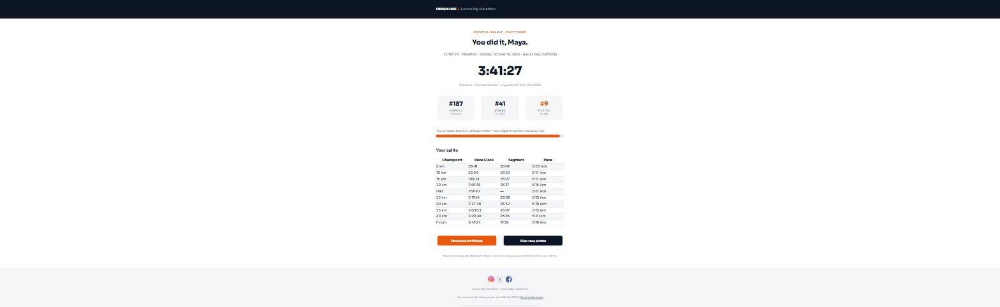
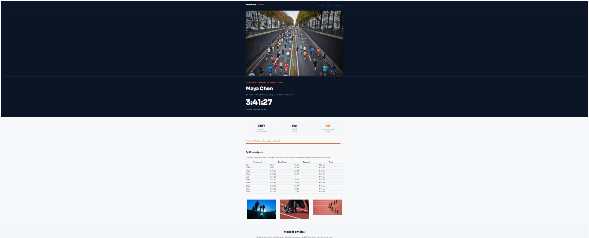
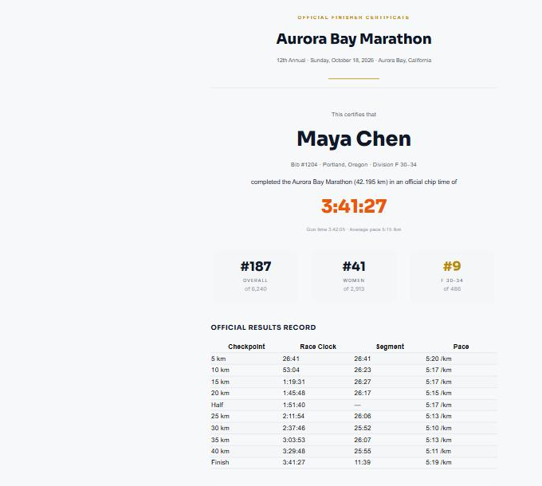

# 🏁 Finish Line

**One React codebase. Three render modes. Every runner gets an email, a web page, and a printable certificate — from a single source of truth.**

Finish Line is a race-day results suite for running events, built entirely with [Unlayer Elements](https://github.com/unlayer/elements) (`@unlayer/react-elements`). Feed it one finisher record and it renders the complete post-race experience: the official results **email**, the public results **web page**, and a print-ready finisher **certificate**.

---

## 🏃 What this is

When Maya Chen crosses the line at the (fictional) Aurora Bay Marathon, the timing system has one job left: turn her chip data into deliverables. Finish Line does exactly that with three Elements templates that all consume the same `raceData` object:

| Mode | Template | Output |
|---|---|---|
| `<Email>` | Official finisher results email | Bulletproof, table-based HTML (Outlook/Gmail-safe) + a plain-text MIME part |
| `<Page>` | Public results page | Responsive flexbox web HTML with hero, splits analysis, and photo gallery |
| `<Document>` | Finisher certificate + official results record | Print-ready HTML for PDF export |

Swap `raceData` for a row from your timing database and every output updates together — same times, same placements, same verification ID, everywhere.

## 📸 Screenshots

| Email | Page | Certificate |
|---|---|---|
|  |  |  |

## 🚀 How to run

```bash
npm install
npm run render
```

Everything lands in `output/`:

```
output/
├── email.html              # <Email> — table-based, client-safe HTML
├── email.txt               # renderToPlainText — text/plain MIME part
├── page.html               # <Page> — responsive web HTML
├── certificate.html        # <Document> — print-ready certificate
├── email.design.json       # renderToJson — editor-compatible design JSON
├── page.design.json
└── certificate.design.json
```

Open the `.html` files in a browser; drop the `.design.json` files into the Unlayer visual editor to keep iterating there.

## 🧱 Architecture

```
src/
├── lib/
│   ├── data.ts        # Single source of truth: event, runner, result, 5K splits
│   ├── theme.ts       # Shared palette (race-day orange on slate) + Sora/Inter font stacks
│   └── tools.ts       # Custom Elements tools via registerTool (StatTile, FieldBar)
└── templates/
    ├── ResultsEmail.tsx         # <Email> — masthead, hero time, stat tiles, splits, CTAs
    ├── ResultsPage.tsx          # <Page> — nav, hero, split analysis, gallery, CTA band
    └── FinisherCertificate.tsx  # <Document> — certificate + official results record
```

- **`lib/data.ts`** — one typed `raceData` object (event, runner, chip/gun times, placements, ten 5K splits) plus pre-shaped rows for the `<Table>` component. Every template imports from here; nothing is duplicated.
- **`lib/theme.ts`** — one shared visual language: colors and font stacks used by all three modes, with Google Fonts (Sora + Inter) injected via `renderToHtml`'s `fonts` option.
- **`lib/tools.ts`** — two custom tools registered with the same config shape as the editor's `unlayer.registerTool`, each with **separate `email` and `web` exporters**.
- **`templates/`** — three JSX templates composed from stock Elements (`Row`, `Column`, `Heading`, `Paragraph`, `Button`, `Table`, `Image`, `Menu`, `Social`, `Divider`) plus the custom tools.

## ✨ Why this shows off Elements

- **All three render modes, one codebase.** `<Email>`, `<Page>`, and `<Document>` each get a real, purpose-built template — not the same layout pasted three times — yet they share every byte of data and theme.
- **Custom tools with per-mode exporters.** `StatTile` (big-number metric tile) and `FieldBar` ("faster than 97% of the field" progress bar) are built with `registerTool`. The email exporter emits bulletproof nested tables with `bgcolor` fallbacks; the web exporter emits clean divs. Same API as the editor's `unlayer.registerTool`, so they're editor-ready.
- **Plain-text rendering.** `renderToPlainText` produces the `text/plain` MIME part alongside the HTML email — the detail real ESPs care about.
- **Editor round-trip.** `renderToJson` exports editor-compatible design JSON for every template, so code-authored designs can be handed to a marketer in the Unlayer visual editor.
- **Shared data source of truth.** One `raceData` object drives three outputs. That's the practical pitch: wire it to a timing feed and every finisher gets a personalized email, page, and certificate automatically.
- **The full component palette.** Layouts (`ColumnLayouts`), `Table` with alternating rows and custom borders, `Menu`, `Social`, `Image` galleries, and `renderToHtml`'s `fonts` option for Google Fonts.

## ✅ Features

- [x] Chip-timed results email with preview text, stat tiles, splits table, and dual CTAs
- [x] Public results page with hero, split analysis, photo gallery, and 2027-entry CTA band
- [x] Print-ready finisher certificate and official results record (Document mode)
- [x] Two custom `registerTool` components with email/web exporters
- [x] Plain-text email part via `renderToPlainText`
- [x] Design JSON export via `renderToJson` (Unlayer editor round-trip)
- [x] Shared theme + Google Fonts (Sora, Inter) across all modes
- [x] Fully typed, fictional sample data — swap in your own timing feed

## 📄 License

MIT

---

*Built for the Unlayer Elements template competition — **#BuiltWithElements***
